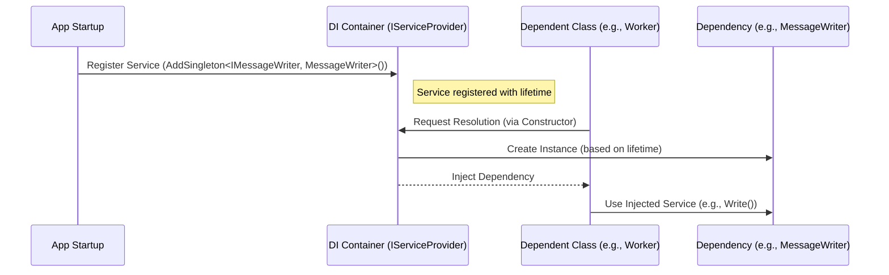

🚀 Dependency Injection in .NET 🚀

# Dependency Injection (DI)
`Last Date : Aug-18-2025`
<br/>
<br/>


📖 What is Dependency Injection? 📖

Dependency Injection is a software design pattern that implements Inversion of Control (IoC). In simple terms, instead of a class creating its own dependencies (like instantiating objects it needs), those dependencies are provided ("injected") from an external source, typically a container. In .NET, this is handled by a built-in service container via the `IServiceProvider` interface. DI promotes loose coupling by abstracting dependencies through interfaces or base classes, making your code more modular.
<br/>

💡 Why Use Dependency Injection? 💡

DI offers several key benefits that make it essential for professional .NET development:
- **Reduced Coupling**: Classes aren't tightly bound to specific implementations, allowing easier changes or swaps.
- **Improved Testability**: You can inject mock objects during unit tests, isolating components.
- **Centralized Configuration**: All dependencies are configured in one place (e.g., at app startup), avoiding scattered code.
- **Flexibility and Maintainability**: It supports features like configuration, logging, and options patterns seamlessly integrated in .NET.
- **Better Scalability**: Especially in web apps, it helps manage object lifetimes efficiently to handle high loads without resource leaks.

Without DI, code can become rigid and hard to maintain, leading to "spaghetti code." In .NET, using DI aligns with best practices for cloud-native and cross-platform apps.

🛠️ How to Implement Dependency Injection? 🛠️

> Implementing DI in .NET involves three core steps: registering services, resolving them, and managing their lifetimes. .NET provides a simple, built-in container—no third-party libraries needed (though you can use them).
<br/>

1. **Registration**: Add services to an `IServiceCollection` during app startup, often in `Program.cs`. Use methods like `AddSingleton<T>`, `AddScoped<T>`, or `AddTransient<T>`.
   - Example: `builder.Services.AddSingleton<IMessageWriter, MessageWriter>();`
   - You can register multiple implementations for the same interface and resolve them as an `IEnumerable<T>`.

2. **Resolution**: The container automatically injects dependencies, primarily via constructor injection (recommended). Manual resolution is possible with `GetService<T>()` or `GetRequiredService<T>()`.
   - Example Constructor: `public class Worker(IMessageWriter writer) { ... }`

3. **Service Lifetimes** ⏳: Choose based on how long the service should live:
   - **Transient**: Created every time requested—ideal for lightweight, stateless services.
   - **Scoped**: Created once per request (e.g., HTTP request in web apps)—great for services that hold per-request state, like database contexts.
   - **Singleton**: Created once for the app's lifetime—use for shared, thread-safe resources.

   | Lifetime   | When Created | Use Case Example |
   |------------|--------------|------------------|
   | Transient | Every request | Stateless calculators |
   | Scoped    | Per scope (e.g., per HTTP request) | Entity Framework DbContext |
   | Singleton | Once at startup | Configuration caches |

In console apps or background services, use `IServiceScopeFactory` to create scopes manually.

✅ Best Practices for Dependency Injection, To avoid common pitfalls:
- Always abstract dependencies with interfaces for flexibility.
- Avoid injecting scoped services into singletons directly—use factories to prevent "captive dependencies."
- Handle constructor overloads carefully; ensure only one is injectable.
- Use `TryAdd{Lifetime}` to prevent duplicate registrations.
- Make singletons thread-safe, as they can be accessed concurrently.
- Dispose of services properly; the container handles `IDisposable` implementations automatically.
- Common Pitfall: Resolving services too early can lead to null references—register everything at startup.

These practices ensure your app is robust, especially in multi-threaded or web environments.

💻 Examples of Dependency Injection 💻

Here's a simple example of a message writer service:
<br/>

```csharp
// Interface
public interface IMessageWriter
{
    void Write(string message);
}

// Implementation
public class ConsoleMessageWriter : IMessageWriter
{
    public void Write(string message) => Console.WriteLine(message);
}

// Registration in Program.cs
builder.Services.AddSingleton<IMessageWriter, ConsoleMessageWriter>();

// Usage in a class
public class MyService(IMessageWriter writer)
{
    public void Log() => writer.Write("Hello, DI!");
}
```
<br/>

For integration with logging (chained DI):

```csharp
public class LoggingMessageWriter(ILogger<LoggingMessageWriter> logger) : IMessageWriter
{
    public void Write(string message) => logger.LogInformation(message);
}
```
<br/>

> In ASP.NET Core, framework services like `ILogger<T>` are auto-registered.
<br/>

🌐 Integration with ASP.NET Core:

ASP.NET Core has first-class DI support. Services are registered in `Program.cs` using the host builder. Framework services (e.g., `IHostingEnvironment`, `IOptions<T>`) are pre-registered. For web apps, scoped services align with HTTP requests, making it perfect for Entity Framework Core DbContexts. Example: `builder.Services.AddDbContext<MyDbContext>(options => ...);` registers it as scoped by default.
<br/>
🔍 Mermaid Diagram: Dependency Injection Flow 🔍

To visualize how DI works in .NET, here's a Mermaid sequence diagram showing registration, resolution, and usage:
<br/>


<br/>

This diagram illustrates the flow from startup to runtime usage, highlighting the container's role.

This topic is a great starting point for refreshing .NET skills—mastering DI will enhance your ability to architect clean, enterprise-level applications.

<br/>

------
