# Amazon ECS Anywhere
`Last Date : Aug-17-2025`
<br/>
<br/>


### 1\. Overview 🚀

Let's dive into **Amazon ECS Anywhere**, a powerful and innovative feature that extends the simplicity and scalability of **Amazon Elastic Container Service (ECS)** to your own infrastructure. While traditional ECS runs on AWS-managed resources like Amazon EC2 or AWS Fargate, ECS Anywhere allows you to run and manage your containerized applications on your own on-premises servers or even virtual machines in other clouds.

**Innovation Spotlight**: ECS Anywhere provides a unified control plane. This means you can manage your container workloads running in your data center, at the edge, or on other cloud platforms from the same familiar AWS Management Console, API, and CLI you use for your AWS-based workloads. This eliminates the complexity of managing separate orchestration tools and provides a consistent operational experience.

### 2\. Problem Statement & Business Use Cases 🛠️

The primary problem ECS Anywhere solves is the need for a seamless hybrid cloud strategy. Many organizations have significant on-premises investments, data residency requirements, or latency-sensitive applications that must run close to the end-user or data source. However, they still want the benefits of a modern, cloud-native container orchestration service.

**Real-world Scenario:** Imagine a retail company with hundreds of physical stores. Each store has local servers for point-of-sale (POS) systems, inventory management, and customer-facing digital displays. To modernize their applications, they want to use containers.

  * **Problem:** They need a way to centrally manage and deploy application updates to all these store-level servers without having to manage a separate container orchestration system in each location.
  * **Solution:** They can use ECS Anywhere to register their on-premises servers in each store as a part of an ECS cluster. From their central AWS account, they can then deploy and manage containerized applications for their POS system or digital signage across all stores with a single API call. This ensures consistency, simplifies operations, and accelerates their modernization efforts.

**Industries/Applications where ECS Anywhere is a game-changer:**

  * **Retail:** As described above, for managing edge computing workloads in physical stores.
  * **Manufacturing:** For running data processing and machine learning workloads on-site to analyze sensor data from factory floor equipment without sending large volumes of data to the cloud.
  * **Telecommunications:** For deploying network function virtualization (NFV) and other latency-sensitive services at the network edge.
  * **Media and Entertainment:** For local rendering farms or content processing workflows that need to leverage existing on-premises hardware.

### 3\. Core Principles 💡

ECS Anywhere is built on the core principles of the standard Amazon ECS service, but with a twist for hybrid environments.

  * **Container Agent:** Each on-premises server or VM that you want to manage with ECS Anywhere must run the **Amazon ECS container agent**. This agent is responsible for communicating with the ECS control plane in the AWS cloud. It reports the instance's resource utilization and takes instructions from the control plane to start or stop container tasks.
  * **Systems Manager (SSM) Agent:** To enable the ECS container agent to securely communicate with the AWS control plane, the on-premises instance must also have the **AWS Systems Manager Agent (SSM Agent)** installed. SSM provides a secure way to register your instances with AWS and manage them. This is the mechanism that allows your on-premises hosts to appear as "managed instances" in your AWS account.
  * **ECS Cluster:** In AWS, you create an ECS cluster, which is a logical grouping of container instances. With ECS Anywhere, you can have a single cluster that contains a mix of both EC2 instances (in AWS) and your on-premises instances. This is what provides the unified management experience.
  * **Task Definition:** A task definition is a blueprint for your application, defining which Docker image to use, how much CPU and memory it needs, what ports to open, and other configurations. For ECS Anywhere, you can use the same task definitions you use for your cloud workloads.
  * **Launch Type `EXTERNAL`:** When you create a task or service for your ECS Anywhere instances, you specify the **`EXTERNAL`** launch type. This tells ECS to deploy the tasks onto your on-premises managed instances instead of an EC2 instance or Fargate.

### 4\. Pre-Requirements 📋

Before you can start using ECS Anywhere, you'll need the following:

  * **An AWS Account:** With appropriate IAM permissions to create and manage ECS clusters and Systems Manager resources.
  * **On-Premises Servers/VMs:** The hosts where you want to run your containers. They need to meet the minimum requirements, including a supported operating system (e.g., Ubuntu, RHEL, CentOS) and sufficient CPU/memory.
  * **Docker:** The Docker daemon must be installed and running on your on-premises hosts.
  * **Network Connectivity:** Your on-premises hosts must have outbound internet access to communicate with the AWS ECS and Systems Manager endpoints. For a production environment, it is highly recommended to use **AWS Direct Connect** or a **VPN** to establish a secure and private connection to your AWS VPC.

### 5\. Implementation Steps 📝

1.  **Create an ECS Cluster:** In the AWS Management Console, create a new ECS cluster. Choose the "Cluster with EC2 instances" template. Note that even though we're using on-premises hosts, the cluster is still provisioned in an AWS region.
2.  **Generate an Activation Key:** In AWS Systems Manager, navigate to "Hybrid Activations" and create a new activation. This will generate an **Activation Code** and an **Activation ID** that you will use to register your on-premises hosts.
3.  **Install the Agents:** On each of your on-premises servers or VMs, run the provided AWS installation script. This script automatically installs the **SSM Agent** and the **ECS container agent** and uses the activation key to register the host with your ECS cluster.
4.  **Verify Registration:** Once the agents are installed, your on-premises hosts will appear as "managed instances" in AWS Systems Manager Fleet Manager and "container instances" within your ECS cluster.
5.  **Create a Task Definition:** Define your application's container configuration in a new ECS Task Definition. Specify your Docker image and other parameters.
6.  **Run a Task or Service:** Use the ECS console, API, or CLI to run a task or create a service. When you do, choose the `EXTERNAL` launch type and select the cluster containing your on-premises instances. ECS will then schedule and deploy your containerized application to one of the available on-premises hosts.

### 6\. Data Flow Diagram 📊

#### Diagram 1: ECS Anywhere Core Architecture

This diagram illustrates the fundamental communication between your on-premises infrastructure and the AWS cloud.

```mermaid
graph TD
    subgraph On-Premises Environment
        OnPremHost1[On-Premises Server/VM 🖥️]
        OnPremHost2[On-Premises Server/VM 🖥️]
        ECS_Agent[ECS Container Agent 🤖]
        SSM_Agent[SSM Agent 🛡️]
        Docker[Docker Daemon 🐳]
        Container[Application Container 📦]
        OnPremHost1 --> SSM_Agent
        OnPremHost1 --> Docker
        Docker --> Container
        SSM_Agent --> ECS_Agent
    end

    subgraph AWS Cloud
        ECSControlPlane[ECS Control Plane ☁️]
        SSMService[AWS Systems Manager ☁️]
        IAM[IAM Roles/Policies 🔐]
        ECR[Amazon ECR 🖼️]
    end

    OnPremHost1 -- Reports Health, Requests Tasks --> ECS_Agent
    ECS_Agent -- Connects securely via SSM --> SSM_Agent
    SSM_Agent -- Establishes connection to --> SSMService
    SSMService -- Manages instance registration --> ECSControlPlane
    ECSControlPlane -- Schedules tasks --> ECS_Agent
    ECS_Agent -- Pulls container image --> ECR
    ECS_Agent -- Starts/Stops container --> Docker
    Container --> OnPremHost1
    ECSControlPlane --> IAM
    IAM --> SSMService
    IAM --> ECS_Agent
```



#### Diagram 2: Hybrid Application Deployment

This diagram shows a more complete data flow for deploying a containerized application from a CI/CD pipeline.

```mermaid
graph TD
    subgraph Developer Workflow
        Developer[Developer 💻]
        CodeCommit[AWS CodeCommit 📝]
        CodeBuild[AWS CodeBuild 🏗️]
        CodePipeline[AWS CodePipeline ⚙️]
        ECR[Amazon ECR 🖼️]
    end

    subgraph AWS Cloud
        ECSControlPlane[ECS Control Plane ☁️]
        ECSCluster[ECS Cluster (Hybrid) 📊]
        CloudWatch[Amazon CloudWatch 📈]
    end

    subgraph On-Premises Environment
        OnPremHost[On-Premises Server 🖥️]
        ECS_Agent[ECS Agent 🤖]
        Docker[Docker Daemon 🐳]
        AppContainer[Application Container 📦]
    end

    Developer -- Pushes code --> CodeCommit
    CodeCommit --> CodePipeline
    CodePipeline -- Triggers build --> CodeBuild
    CodeBuild -- Builds Docker image --> Docker[Docker CLI 🐳]
    Docker[Docker CLI 🐳] -- Pushes to --> ECR
    ECR --> CodePipeline
    CodePipeline -- Deploys new task definition --> ECSControlPlane
    ECSControlPlane -- Schedules task on --> ECSCluster
    ECSCluster -- Instructs ECS Agent to run task --> ECS_Agent
    ECS_Agent -- Pulls image from --> ECR
    ECS_Agent -- Runs container --> AppContainer
    AppContainer --> Docker
    Docker --> OnPremHost
    AppContainer -- Sends logs/metrics --> CloudWatch
```

### 7\. Security Measures 🛡️

  * **Least Privilege IAM Roles:** Create a dedicated IAM role for ECS Anywhere that grants only the necessary permissions for the SSM Agent and ECS Agent to communicate with the AWS control plane. Use managed policies like `AmazonSSMManagedInstanceCore` and `AmazonEC2ContainerServiceforEC2Role` as a starting point, and then restrict them further based on your needs.
  * **VPC Endpoints & Private Connectivity:** For production environments, avoid communicating over the public internet. Use a **VPN connection** or **AWS Direct Connect** to connect your on-premises network to your AWS VPC. This allows the ECS and SSM agents to communicate with AWS services over a private, secure connection. You can also configure VPC Endpoints for the ECS and SSM services to ensure all traffic stays within the AWS network.
  * **Data Encryption:** Ensure that your data is encrypted both in transit and at rest. Use **AWS KMS** for key management and enforce TLS for all communications.
  * **Patch Management:** Use **AWS Systems Manager Patch Manager** to ensure your on-premises hosts are consistently patched and secure, just like your EC2 instances.

### 8\. Containerization and Portability

ECS Anywhere makes your containerized workloads truly portable. You can develop and test applications in your local environment, use the same task definitions to deploy them to a staging cluster on EC2, and then seamlessly deploy them to your production on-premises hardware. This consistency reduces deployment risk and operational overhead, empowering developers to focus on the application logic rather than the underlying infrastructure. It's a key step in a modern application modernization strategy.

### 9\. When to use and when not to use 🤔

**When to Use ECS Anywhere:**

  * You have existing on-premises infrastructure that you want to continue using while leveraging a cloud-native container orchestration service.
  * Your applications have strict data residency or compliance requirements that prevent them from running in the public cloud.
  * Your workloads are latency-sensitive and must run close to the end-users or data sources at the edge.
  * You need a single, unified control plane to manage containers across your entire hybrid environment.

**When not to Use ECS Anywhere:**

  * You are building a brand-new, cloud-native application from scratch with no on-premises dependencies. In this case, using a pure ECS on EC2 or Fargate solution would be simpler.
  * Your on-premises network has unreliable or high-latency connectivity to the AWS cloud. While tasks continue to run, you lose management and monitoring capabilities during a network outage.
  * You need to use specific ECS features that are not yet supported for the `EXTERNAL` launch type (e.g., certain networking modes or service discovery capabilities). Always check the latest documentation for feature compatibility.

### 10\. Costing Calculation 💰

  * **How it is calculated:** ECS Anywhere pricing is very straightforward. You are charged a flat rate per hour for each on-premises instance that is registered and connected to the ECS control plane. There is no charge for the ECS control plane itself.

      * The current rate is approximately **$0.01025 per hour per instance**.
      * This is rounded up to the nearest second.
      * You are not charged when the instance is deregistered or disconnected.

  * **Efficient way of handling this service:**

      * **Right-size your instances:** Ensure your on-premises hosts are appropriately sized for your container workloads to maximize resource utilization and minimize the number of instances you need to manage.
      * **Deregister instances when not in use:** If you have temporary on-premises capacity that you don't need all the time, make sure to deregister the instances from the ECS cluster to stop incurring costs.
      * **Use the free tier:** AWS offers a free tier for ECS Anywhere, providing 2,200 instance hours per month for the first 6 months, which is great for proof-of-concept and development.
      * **Monitor data transfer costs:** While the ECS Anywhere charge is fixed, you will still be charged for standard data transfer fees for communication between your on-premises network and AWS, especially if you use a VPN or Direct Connect.

  * **Sample Calculations:**

      * **Scenario 1:** You manage 5 on-premises instances with ECS Anywhere, and they are connected 24/7 for a month (30 days).
          * Calculation: 5 instances x 30 days x 24 hours/day x $0.01025/hour = **$36.90**
      * **Scenario 2:** You have 10 instances used for a specific project, and they are only connected for 100 hours in a month.
          * Calculation: 10 instances x 100 hours x $0.01025/hour = **$10.25**

### 11\. Alternative services in AWS/Azure/GCP/On-Premise 🔄

| Service | Provider | Key Difference/Comparison |
| :--- | :--- | :--- |
| **AWS EKS Anywhere** | AWS | While ECS Anywhere is based on a managed AWS service, EKS Anywhere is an open-source tool that allows you to run a Kubernetes control plane on your own infrastructure. This offers greater flexibility and control but requires more management overhead. |
| **Azure Arc-enabled Kubernetes** | Microsoft Azure | A feature that extends Azure's management capabilities to Kubernetes clusters running anywhere, on-premises or on other clouds. It provides a centralized view and management from the Azure portal. |
| **Google Anthos** | Google Cloud | A platform for managing applications across on-premises, Google Cloud, and other public clouds. It's built on a foundation of open-source technologies like Kubernetes and Istio, offering a comprehensive hybrid and multi-cloud solution. |
| **Red Hat OpenShift** | Red Hat (IBM) | A leading enterprise-grade Kubernetes platform that can be deployed on-premises, in the cloud, or as a managed service. It's an open-source solution that provides a complete application platform. |
| **On-Premise Kubernetes** | Self-Managed | You can set up and manage your own Kubernetes clusters on-premises using tools like kubeadm. This gives you full control but requires significant expertise and a dedicated team to handle the operational complexity, maintenance, and security of the control plane. |

**On-Premise Kubernetes Data Flow Diagram:**

```mermaid
graph TD
    subgraph On-Premises Data Center
        KubeMaster[Kubernetes Master Node 🧠]
        KubeWorker1[Kubernetes Worker Node 👷]
        KubeWorker2[Kubernetes Worker Node 👷]
        ETCD[etcd (Cluster State DB)]
        KubeAPI[API Server]
        Scheduler[Scheduler]
        Controller[Controller Manager]
        KubeMaster -- Communicates with --> KubeWorker1
        KubeMaster -- Communicates with --> KubeWorker2
        KubeMaster -- Uses --> ETCD
        KubeMaster -- Runs --> KubeAPI
        KubeMaster -- Runs --> Scheduler
        KubeMaster -- Runs --> Controller
        KubeWorker1 -- Runs --> Kubelet
        KubeWorker1 -- Runs --> Containerd
        KubeWorker2 -- Runs --> Kubelet
        KubeWorker2 -- Runs --> Containerd
        Kubelet[Kubelet] -- Manages containers --> Containerd[Containerd]
    end

    subgraph CI/CD Pipeline
        Dev[Developer 💻]
        GitHub[GitHub Repo]
        Jenkins[Jenkins CI Server]
    end

    Dev -- Pushes code --> GitHub
    GitHub -- Webhook trigger --> Jenkins
    Jenkins -- Builds image & pushes to registry --> DockerRegistry[On-Premise Docker Registry 🖼️]
    Jenkins -- Deploys via `kubectl` --> KubeAPI
    KubeAPI -- Manages cluster state --> KubeMaster
    KubeMaster -- Schedules pod on --> KubeWorker1
    Kubelet -- Pulls image from --> DockerRegistry
    Kubelet -- Starts container via --> Containerd
```

### 12\. Benefits 📈

  * **Unified Management:** A single pane of glass to manage container workloads across AWS and on-premises environments.
  * **Operational Consistency:** Use the same familiar ECS APIs, CLI, and console for both cloud and on-premises deployments.
  * **Leverage Existing Investments:** Maximize the value of your existing on-premises hardware without needing to migrate everything to the cloud.
  * **Accelerated Modernization:** Easily containerize legacy applications and run them on your on-premises hardware with a modern orchestration service.
  * **Hybrid and Edge Computing:** Ideal for workloads that need to be close to the data source or end-user for low latency, such as IoT or retail applications.
  * **Scalability:** Burst workloads from your on-premises data center to the AWS cloud during peak demand.

### 13\. Hybrid Cloud Strategy

ECS Anywhere is a core component of a well-architected hybrid cloud strategy. It allows you to maintain control over your on-premises infrastructure while benefiting from the powerful, managed services of the AWS cloud. By enabling seamless movement of containers and a unified operational model, it reduces the complexity and cost of managing disparate environments. This makes it easier to adopt a true hybrid approach where you use the right infrastructure for the right workload, whether it's on-premises, in the cloud, or at the edge.

### 14\. Summary 📝

Amazon ECS Anywhere is a powerful solution that extends the simplicity and scalability of the AWS ECS service to your on-premises data centers and edge locations. It provides a unified control plane, allowing you to manage container workloads across your entire hybrid environment with a single set of tools and APIs. This ensures operational consistency, accelerates application modernization, and enables new use cases for low-latency and data-intensive applications. It’s an ideal choice for organizations looking to bridge the gap between their on-premises investments and the benefits of the AWS cloud.

**Top 5 things to keep in mind about ECS Anywhere:**

1.  **Unified Control Plane:** Remember that all management and orchestration happens from the AWS cloud, even for on-premises tasks.
2.  **Agent Dependency:** Your on-premises hosts must have both the SSM Agent and ECS Container Agent installed and running to communicate with AWS.
3.  **Connectivity is Key:** A stable, low-latency connection to the AWS region is crucial for reliable task management.
4.  **Launch Type `EXTERNAL`:** The key differentiator in your task definition is the `EXTERNAL` launch type, which tells ECS to schedule the task on an on-premises host.
5.  **Cost is per Instance-Hour:** The pricing model is simple and based on the number of hours your on-premises instances are connected and managed by ECS Anywhere.

### 15\. Related Topics 📚

  * **AWS Systems Manager:** The underlying service that enables hybrid instance management.
  * **AWS EKS Anywhere:** The Kubernetes alternative for a hybrid cloud container strategy.
  * **Containerization Best Practices:** How to create efficient and secure Docker images for deployment.
  * **AWS Direct Connect and VPN:** For establishing secure and private network connections to AWS.

This video provides a great overview and a practical demonstration of how to get started with Amazon ECS Anywhere. [How can I run containers on Amazon ECS Anywhere or in cloud](https://www.youtube.com/watch%3Fv%3Dk_x-bE06v64)