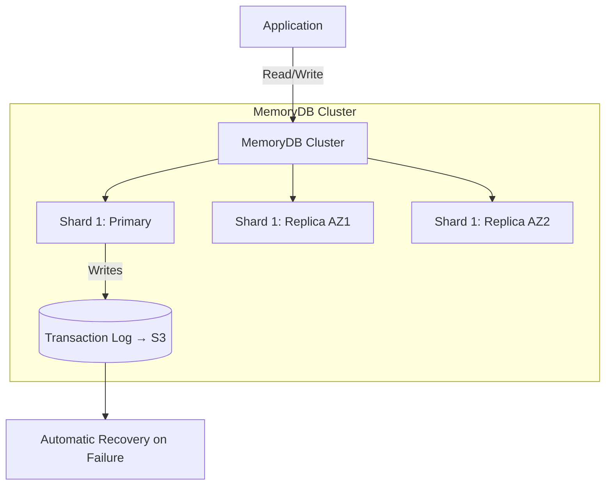
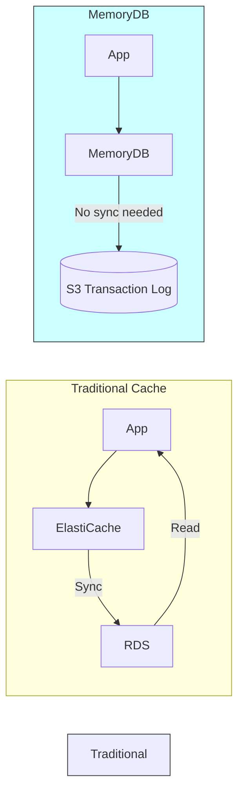
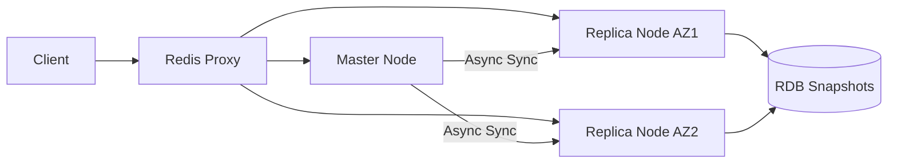

# Memory DB

`Last Date : Aug-17-2025`
<br/>
<br/>


# 🚀 **Amazon MemoryDB: The Redis-Powered Persistent Database**  
*Your definitive guide to low-latency, durable data storage (Updated August 2025)*  

---

## 1. Overview 🌐  
**Amazon MemoryDB** is a **Redis-compatible**, multi-AZ distributed database that delivers **microsecond latency** with **full durability** – no cache-DB sync complexity. Unlike ElastiCache (which is *just* a cache), MemoryDB uses a **distributed transaction log** (stored in Amazon S3) to rebuild the entire dataset after failures, making it suitable as a *primary database*. 🛠️  

> 💡 **Innovation Spotlight**: First managed service to offer **Redis API + ACID compliance** – bridging the gap between cache and database.

---

## 2. Problem Statement & Business Use Cases 💼  
### Real-World Scenario:  
A fintech app uses ElastiCache for session storage but faces **data loss during failovers**. User sessions vanish when nodes crash, forcing re-authentication. Manually syncing cache → RDS adds 150ms latency – unacceptable for real-time trading.  

### Industries/Applications:  
- **FinTech**: Real-time portfolio tracking (e.g., stock price updates at 10K ops/sec).  
- **Gaming**: Leaderboard persistence with zero downtime during tournaments.  
- **AdTech**: Fraud detection storing user behavior patterns with sub-millisecond reads.  

---

## 3. Core Principles 🔑  
### Foundational Concepts:  
- **Redis Compatibility**: Runs standard Redis 7.0 commands (no code changes needed).  
- **Distributed Transaction Log**: Writes go to **shard-based log streams** (Kinesis-like) → S3 → rebuilt on failover.  
- **Multi-AZ Durability**: 6 copies of data (3 shards × 2 AZs) with automatic failover in <30 sec.  

### Key Service Components:  
| **Term**               | **Explanation**                                                                 |
|------------------------|-------------------------------------------------------------------------------|
| **Shard**              | Group of nodes (1 primary + up to 5 replicas) handling a data partition.      |
| **Transaction Log**    | Immutable sequence of writes stored in S3 (used for recovery/replication).    |
| **Cluster**            | Collection of shards (1-5) for horizontal scaling.                            |
| **Multi-AZ Deployment**| Data replicated across 3 AZs – survives AZ failure with zero data loss.       |

---

## 4. Pre-Requirements 📋  
- **Redis 6.0+ Client**: `redis-py`, `ioredis`, or AWS SDK.  
- **VPC Configuration**: MemoryDB *only* accessible within VPC (no public endpoints).  
- **IAM Policies**:  
  - `memorydb:CreateCluster`  
  - `kms:Decrypt` (for encryption keys)  
- **S3 Bucket**: For transaction logs (auto-created if none specified).  

---

## 5. Implementation Steps 🛠️  
1. **Create Subnet Group**:  
   ```bash
   aws memorydb create-subnet-group --subnet-group-name prod-mdb \
   --subnet-ids subnet-abc123 subnet-def456
   ```  
2. **Launch Cluster**:  
   ```bash
   aws memorydb create-cluster --cluster-name trading-sessions \
   --node-type db.m7g.large --num-shards 2 --engine-version 7.0
   ```  
3. **Connect via Redis CLI**:  
   ```bash
   redis-cli -h trading-sessions.123456789012.us-east-1.memorydb.aws \
   -p 6379 --tls --cacert memorydb.pem
   ```  
4. **Test Failover**: Trigger manual failover via AWS Console → Verify data persistence.  

---

## 6. Data Flow Diagrams 📊  
### Diagram 1: MemoryDB Architecture  


### Diagram 2: Traditional Cache vs. MemoryDB  


---

## 7. Security Measures 🔒  
- **Encryption**:  
  - In-transit: TLS 1.3 (enforced by default)  
  - At-rest: KMS keys for data + S3 logs  
- **Network Isolation**:  
  - VPC-only access + Security Groups (no public IPs)  
  - VPC Peering for cross-account access  
- **Access Control**:  
  - IAM authentication (no Redis passwords)  
  - Fine-grained ACLs (e.g., `user1: +get +set`)  

---

## 8. MemoryDB vs. ElastiCache: Strategic Tradeoffs ⚖️  
| **Factor**          | MemoryDB                          | ElastiCache for Redis             |
|---------------------|-----------------------------------|-----------------------------------|
| **Use Case**        | Primary database (durable)        | Cache (ephemeral)                 |
| **Recovery RPO**    | 0 (zero data loss)                | Seconds-minutes (depends on sync) |
| **Cost (per node)** | 20% higher                        | Lower                             |
| **Best For**        | Session stores, leaderboards      | Page caching, rate limiting       |

> 💡 **Pro Tip**: Use MemoryDB for *data you can’t afford to lose*, ElastiCache for *data you can regenerate*.

---

## 9. When to Use (and Avoid) MemoryDB 🚦  
| **Use MemoryDB**                          | **Avoid MemoryDB**                     |
|-------------------------------------------|----------------------------------------|
| Primary database needing Redis API        | Pure read-heavy workloads (<5% writes) |
| Sub-millisecond latency + durability      | Budget constraints (<$500/mo)          |
| Complex data structures (JSON, Sorted Sets)| Simple key-value (DynamoDB cheaper)    |

---

## 10. Costing Calculation 💰  
### How It’s Calculated:  
- **Compute**: $0.426/hr per `db.m7g.large` node (On-Demand, us-east-1)  
- **Storage**: $0.075/GB-month for transaction logs in S3  
- **Data Transfer**: $0.01/GB (within same region)  

### Sample Calculation (2-Shard Cluster):  
| **Resource**          | Monthly Cost | Notes                                  |
|-----------------------|--------------|----------------------------------------|
| 2 Shards × 3 nodes    | $928.56      | (6 nodes × $0.426/hr × 730 hrs)        |
| 100GB Transaction Log | $7.50        | ($0.075 × 100)                         |
| **Total**             | **$936.06**  |                                        |

### Cost Optimization Tips:  
1. **Right-size shards**: Start with 1 shard → scale horizontally only when needed.  
2. **Use Reserved Instances**: 38% savings for 1-year commitment.  
3. **Compress data**: Reduce transaction log size (e.g., use Redis *Hashes* instead of JSON).  

---

## 11. Alternative Services Comparison 🌍  
| **Feature**               | Amazon MemoryDB               | Azure Cache for Redis (Premium) | On-Premise (Redis Cluster) |
|---------------------------|-------------------------------|---------------------------------|----------------------------|
| **Durability**            | ✅ S3-backed logs             | ❌ RDB/AOF snapshots only       | ✅ Custom replication      |
| **Max Data Size**         | 100s of GB                    | 530 GB                          | TBs (manual scaling)       |
| **Native Redis API**      | ✅ 100% compatible            | ✅                              | ✅                         |
| **Managed Failover**      | ✅ <30 sec                    | ✅                              | ❌ Manual                  |
| **ACID Compliance**       | ✅                            | ❌                              | ❌                         |

### On-Premise Redis Cluster Flow:  


---

## 12. Benefits ✅  
- **Zero Data Loss**: Survives AZ failures with identical dataset.  
- **Simplified Architecture**: Eliminates cache-DB sync complexity (e.g., no Lambda sync triggers).  
- **Redis Ecosystem**: Works with RedisInsight, RediSearch, RedisJSON out-of-box.  
- **Predictable Performance**: Consistent <1ms p99 latency even during failover.  

---

## 13. Hidden Pitfall: Write Amplification ⚠️  
MemoryDB writes **every operation to S3** – large `ZADD`/`HSET` commands inflate costs.  
> 🔍 **Fix**:  
> 1. Avoid `KEYS *` scans (use `SCAN`)  
> 2. Compress binary data with `ZSTD`  
> 3. Monitor `EngineCPUUtilization` – scale shards if >70% sustained  

---

## 14. Summary & Key Takeaways 🎯  
MemoryDB is the **first durable Redis database** – ideal for stateful serverless apps needing sub-ms latency *without* data loss risks.  

### Top 5 Things to Remember:  
1. **Not a cache replacement**: Use for *primary data*, not ephemeral data.  
2. **VPC-only access**: Design network topology early (no public endpoints).  
3. **Shard = scaling unit**: Add shards (not nodes) to increase throughput.  
4. **S3 costs add up**: Monitor `TransactionLogSize` metric weekly.  
5. **Redis 7.0 features**: Leverage `JSON.SET`/`FT.SEARCH` for complex queries.  

---

## 15. Related Topics 🔗  
- [MemoryDB Transaction Log Deep Dive (AWS Blog)](https://aws.amazon.com/blogs/database/how-amazon-memorydb-transaction-logs-work/)  
- [Redis 7.0 Commands Reference](https://redis.io/commands/)  
- [Cost Calculator Template (GitHub)](https://github.com/aws-samples/memorydb-cost-estimator)  
- [Migrating from ElastiCache to MemoryDB Guide](https://docs.aws.amazon.com/memorydb/latest/devguide/migration.html)  

> 💡 **Final Tip**: Run a **side-by-side test** – deploy identical workloads on MemoryDB vs. ElastiCache+RDS. Measure failover recovery time and data consistency – the difference is staggering!