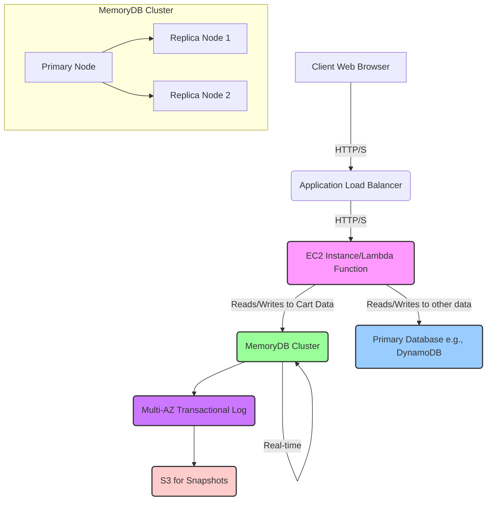
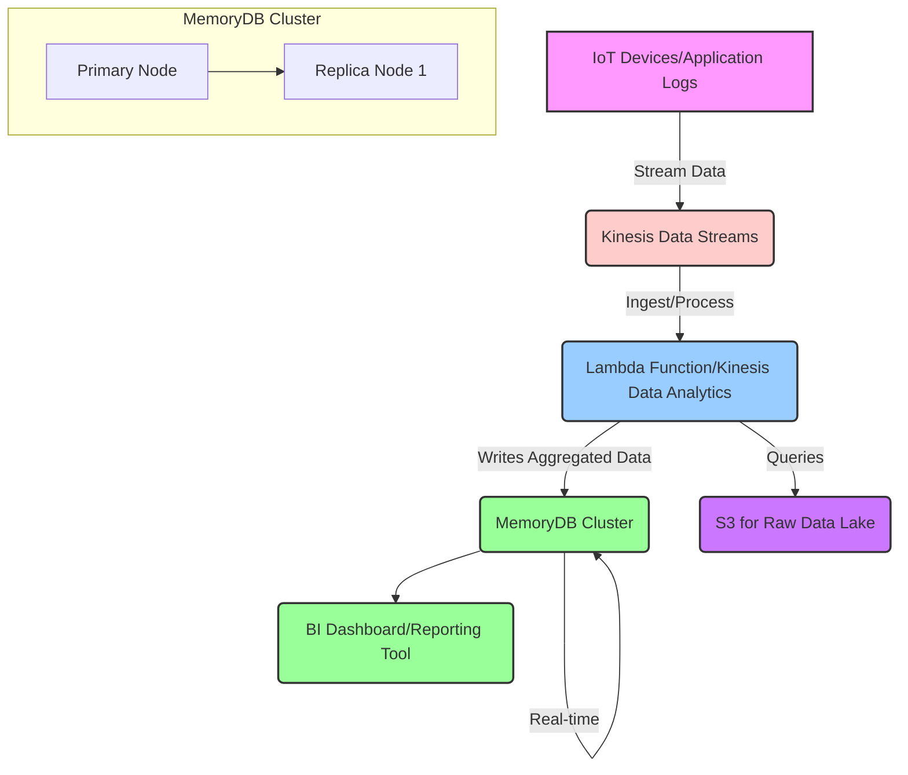
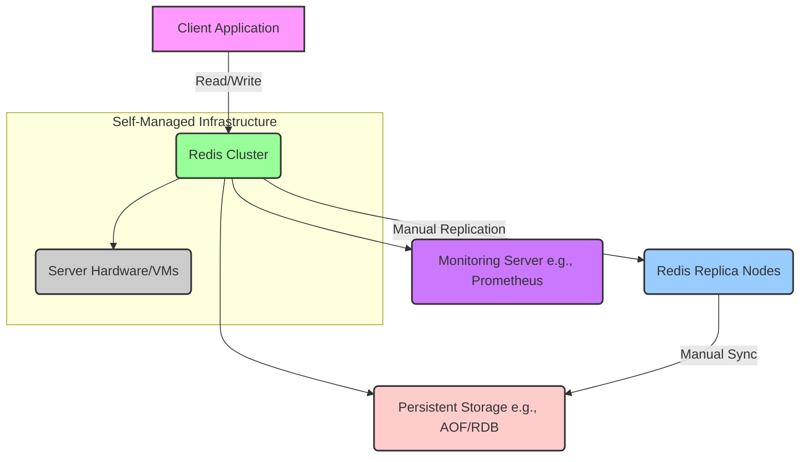

# Amazon Memory DB
`Last Date : Aug-14-2025`
 
 

### **1. Overview**

Amazon MemoryDB for Redis is a fully managed, Redis-compatible, in-memory database service. 🚀 Unlike a traditional in-memory cache, MemoryDB is designed as a primary database, offering both ultra-fast performance and multi-AZ durability. It provides microsecond read and single-digit millisecond write latency by storing all data in memory, while ensuring data persistence through a multi-AZ transactional log. This unique combination makes it ideal for modern, microservices-based applications that demand high-speed data access with high availability and durability.

### **2. Problem Statement & Business Use Cases**

In many real-time applications, a separate caching layer is used in front of a durable, but slower, primary database to handle high-speed reads. This dual-database architecture, while effective, introduces complexity and potential data inconsistencies. Developers must manage data synchronization between the cache and the primary database, handle cache invalidation, and deal with the risk of data loss during cache node failures. MemoryDB solves this by consolidating the cache and the durable database into a single, high-performance service.

**Example Scenario: An E-commerce Shopping Cart**
Consider a high-traffic e-commerce website. A user adds items to their shopping cart. This requires lightning-fast read/write access to the cart data to provide a seamless user experience. With a traditional architecture, this data might be stored in a primary database like Amazon DynamoDB or Amazon RDS, with a cache like Amazon ElastiCache in front of it. If the cache fails, the user might see an empty cart, or the system might have to re-read the data from the slower primary database, leading to a poor user experience.

With MemoryDB, the shopping cart data is stored directly in the durable in-memory database. All reads and writes are ultra-fast, and if a node fails, the data is not lost because of the multi-AZ transactional log. The user's cart remains intact and available with minimal disruption.

**Industries and Applications:**

  - **Gaming & Ad-Tech:** Real-time leaderboards, session management, and user profiles that require low latency and high concurrency.
  - **Financial Services:** High-frequency trading, fraud detection, and payment processing that rely on immediate data access and strong consistency.
  - **Media & Entertainment:** Real-time content recommendations, live event data streams, and dynamic user profiles.
  - **Retail:** Real-time inventory tracking, shopping cart data, and personalized recommendations.

### **3. Core Principles**

  - **In-Memory Performance:** All data is stored in memory, providing microsecond read and single-digit millisecond write latency. This is crucial for applications that require immediate responses.
  - **Multi-AZ Durability:** MemoryDB uses a distributed, multi-AZ transactional log to durably store every write operation. This ensures that data is not lost in the event of a node or Availability Zone failure. This is a key differentiator from services like Amazon ElastiCache, which are primarily caches and may not offer the same level of durability.
  - **Redis Compatibility:** MemoryDB is fully compatible with the Redis API, data structures, and commands. This allows developers to use familiar tools and libraries, making it easy to migrate existing Redis workloads.
  - **Scalability:** MemoryDB clusters can be scaled horizontally (by adding more shards) and vertically (by changing node types) to meet varying performance and capacity demands. It automatically partitions your data across multiple nodes to distribute the workload.
  - **Serverless-like Experience:** While not a true serverless service, MemoryDB is fully managed, handling tasks like hardware provisioning, patching, backups, and failure recovery. This reduces the operational overhead for developers.

**Key Resources & Terminology**

  - **Cluster:** The primary resource in MemoryDB, consisting of one or more shards.
  - **Shard:** A collection of a primary node and one or more replica nodes. Each shard holds a portion of your cluster's data.
  - **Primary Node:** The node within a shard that handles all write operations. Writes are synchronously persisted to the transactional log.
  - **Replica Nodes:** Read-only copies of the primary node's data. They provide high availability and can be used to scale read throughput.
  - **Multi-AZ Transactional Log:** A highly available, durable log that records all write operations. It's the key to MemoryDB's data durability.

### **4. Pre-Requirements**

  - **AWS Account:** An active AWS account is required to provision services.
  - **Amazon VPC:** MemoryDB clusters must be launched within an Amazon Virtual Private Cloud (VPC) for network isolation and security.
  - **Subnet Group:** A collection of subnets in your VPC where the MemoryDB nodes will be deployed. It's best practice to use subnets in different Availability Zones for high availability.
  - **IAM Role:** An IAM role with appropriate permissions to create, manage, and access MemoryDB resources.
  - **Redis Client Library:** An application or service that needs to interact with MemoryDB will require a Redis-compatible client library (e.g., `redis-py` for Python, `StackExchange.Redis` for .NET).

### **5. Implementation Steps**

1.  **Create a VPC and Subnet Group:**

      - Navigate to the VPC dashboard and create a VPC.
      - Create at least two subnets in different Availability Zones within your VPC.
      - Go to the MemoryDB console and create a new **Subnet Group**, adding the subnets you created.

2.  **Create a MemoryDB Cluster:**

      - In the MemoryDB console, choose **Clusters** and click **Create**.
      - Give your cluster a name and select the desired node type (e.g., `db.r6g.large`).
      - Specify the number of shards and replicas per shard. For durability and high availability, at least one replica per shard is recommended.
      - Select the subnet group created earlier.
      - Configure Redis engine settings, including port, and enable encryption if needed.
      - Review and create the cluster.

3.  **Configure Security Group:**

      - Find the security group associated with your MemoryDB cluster.
      - Add an inbound rule to allow traffic on the Redis port (typically 6379) from the security group of your application servers or Lambda functions.

4.  **Connect from Your Application:**

      - Find the cluster endpoint in the MemoryDB console.
      - In your application code, configure the Redis client to connect to this endpoint.
      - Start using Redis commands to read from and write to MemoryDB.

### **6. Data Flow Diagram**

#### **Diagram 1: E-commerce Shopping Cart**

#### **Diagram 2: Real-time Analytics with Stream Processing**

### **7. Security Measures**

  - **VPC Isolation:** Deploy MemoryDB clusters in a private VPC to ensure network isolation. Do not expose cluster endpoints to the public internet.
  - **IAM and VPC Security Groups:** Use IAM roles for fine-grained access control to the MemoryDB service API. Use VPC security groups to control network access to the cluster, allowing traffic only from trusted sources (e.g., your application's security group).
  - **Encryption:** MemoryDB supports encryption at rest and in transit.
      - **Encryption in transit (TLS):** All client-server communication should be encrypted to prevent eavesdropping.
      - **Encryption at rest:** Data in MemoryDB is automatically encrypted on disk, including the transactional log and snapshots, using AWS KMS.
  - **Redis Access Control Lists (ACLs):** MemoryDB supports Redis ACLs, allowing you to define users with specific command permissions (e.g., some users can only read, others can read and write). This provides an additional layer of authorization within the cluster.

### **8. Vector Search with MemoryDB**

Beyond a standard key-value store, MemoryDB for Redis supports **Vector Search**. This is a powerful feature for applications requiring semantic search, recommendations, and anomaly detection.  Instead of searching for exact keywords, vector search allows you to find data based on semantic similarity. For example, a search for "running shoes" could return results for "jogging sneakers." This is achieved by representing data as high-dimensional vectors. MemoryDB can store these vectors and perform fast Approximate Nearest Neighbor (ANN) searches using the `HNSW` (Hierarchical Navigable Small World) index.

### **9. When to use and when not to use**

**When to use MemoryDB:**

  - When you need a primary database with ultra-low latency reads and writes.
  - When you require data durability and high availability without the complexity of a separate cache and database.
  - For microservices architectures where each service needs its own high-performance, durable data store.
  - For workloads that can benefit from the rich Redis data structures, such as queues, pub/sub, and geospatial indexing.
  - When you need to simplify your architecture by eliminating the cache-and-database layer.

**When not to use MemoryDB:**

  - For applications where durability is not a concern, and you just need a simple, high-speed cache. In this case, Amazon ElastiCache might be a more cost-effective solution.
  - For applications requiring complex SQL queries, joins, or relational data models. MemoryDB is a key-value store, not a relational database.
  - For workloads with a very large dataset that won't fit entirely in memory. While MemoryDB can handle large datasets, it will be more expensive as you scale memory. You should consider a database with tiered storage or a hybrid approach.
  - For infrequent or batch processing workloads where the in-memory performance is not a critical requirement.

### **10. Costing Calculation**

MemoryDB pricing is based on a few key components:

  - **Node Hours:** You are charged for the provisioned cluster capacity per hour. The cost varies based on the instance type (e.g., `db.r6g.large`). This is the primary cost driver.
  - **Data Written:** A per-GB charge for all data written to the cluster's transactional log. The first 10TB per month is free. This charge is a key difference from ElastiCache, reflecting MemoryDB's durability.
  - **Snapshot Storage:** Storage for automated and manual snapshots is charged per GB-month. There's no additional charge for snapshot storage up to 100% of your total cluster storage.
  - **Data Transfer:** Standard AWS data transfer costs apply for data moved out of the cluster to other regions or the internet. Data transfer within the same VPC is free.

**Efficient Way of Handling This Service:**

  - **Choose the Right Node Type:** Select a node type that provides enough memory for your working dataset but avoids over-provisioning.
  - **Right-size Your Cluster:** Start with a smaller cluster and scale up as needed. Monitor metrics like `CPUUtilization`, `FreeableMemory`, and `CacheHitRate` to determine when to scale.
  - **Utilize Reserved Nodes:** For predictable, long-term workloads, purchasing reserved nodes for 1-year or 3-year terms can provide significant discounts (up to 55%) compared to on-demand pricing.

**Sample Calculation (Hypothetical):**

  - **Region:** US East (N. Virginia)
  - **Cluster Configuration:** 1 shard, 1 primary node + 1 replica node
  - **Node Type:** `db.r6g.large`
  - **Node Cost:** \~$0.2163/hour per node
  - **Monthly Node Cost (on-demand):** 2 nodes \* $0.2163/hour \* 730 hours/month = **$315.79**
  - **Data Written:** 50 GB/month. The first 10TB are free, so this is free.
  - **Snapshot Storage:** 20 GB of snapshot storage. This is also free as it is less than 100% of the cluster size.
  - **Total Estimated Monthly Cost:** **$315.79** (plus any data transfer out of the region or internet).

### **11. Alternative Services**

| Feature | AWS MemoryDB for Redis | AWS ElastiCache for Redis | GCP Memorystore for Redis | Azure Cache for Redis | On-Premise (Self-Managed Redis) |
|---|---|---|---|---|---|
| **Durability**| **Multi-AZ durable primary database** | In-memory cache, not durable by default | In-memory cache, not durable by default | In-memory cache, not durable by default | Configurable, requires significant effort |
| **Consistency** | Strong Consistency on writes | Eventually consistent | Eventually consistent | Eventually consistent | Configurable, requires significant effort |
| **Use Case** | Primary database for real-time applications | High-speed cache for existing databases | High-speed cache for existing databases | High-speed cache for existing databases | Can be used as both cache and database |
| **Management** | Fully managed | Fully managed | Fully managed | Fully managed | High operational overhead |
| **Pricing** | Billed for node hours and data written | Billed for node hours only | Billed for instance capacity | Billed for instance capacity | Billed for hardware, networking, and labor |
| **Scalability** | Automated, horizontal, and vertical | Automated, horizontal, and vertical | Automated, horizontal, and vertical | Automated, horizontal, and vertical | Requires manual cluster management |

**On-Premise Self-Managed Redis Data Flow:**

### **12. Benefits**

  - **High Performance & Low Latency:** Delivers sub-millisecond latency for reads and single-digit millisecond latency for writes, essential for real-time applications.
  - **Durability & High Availability:** Guarantees data durability and provides high availability with multi-AZ replication and a transactional log, eliminating data loss during failures.
  - **Simplified Architecture:** Eliminates the need for a separate cache and database layer, reducing complexity and operational overhead.
  - **Redis Compatibility:** Leverages the popular Redis API, enabling developers to use a familiar data model and toolset.
  - **Fully Managed:** Automates tedious administrative tasks, allowing developers to focus on building applications rather than managing infrastructure.

### **13. What I need to keep in mind about this topic**

1.  **MemoryDB is a database, not just a cache:** While it offers caching-like performance, its key value proposition is durability and strong consistency, which sets it apart from a typical cache.
2.  **Costs can be high for large datasets:** Because all data is stored in memory, the cost can be substantial for very large datasets that don't fit into smaller node types.
3.  **Data Written is a key cost factor:** Unlike a pure cache, you pay for data written to the transactional log. It's important to monitor this to avoid unexpected costs.
4.  **Use it for the right workloads:** It is best suited for workloads that require both high performance and data durability, such as session stores, leaderboards, and real-time analytics.
5.  **Leverage Redis features:** Don't just use it as a basic key-value store. Utilize advanced Redis data structures and features like streams, Pub/Sub, and geospatial indexing to build powerful applications.

### **14. Summary**

Amazon MemoryDB for Redis is a groundbreaking service that combines the speed of an in-memory database with the durability and availability of a traditional database. It allows developers to build high-performance, real-time applications without the complexity of a dual-database architecture. This solution ensures real-time processing with minimal infrastructure overhead while guaranteeing data integrity.

### **15. Related Topics**

  - [Amazon ElastiCache](https://aws.amazon.com/elasticache/)
  - [Amazon DynamoDB](https://aws.amazon.com/dynamodb/)
  - [Redis Documentation](https://redis.io/docs/)
  - [Using MemoryDB to build real-time applications for performance and durability](https://www.youtube.com/watch?v=-3ATFRburMc)

