# 🪢Azure Stream Analytics


## Concept Title: Real-Time Data Streaming with Azure Stream Analytics 

### Problem Statement & Business Use Cases
A retail e-commerce platform wants to analyze customer browsing and purchasing behavior in real-time to personalize promotions and optimize inventory. The company needs to process high-velocity clickstream data, detect anomalies (e.g., fraudulent transactions), and trigger instant alerts for dynamic pricing or stock replenishment.

**Business Use Cases:**
- **E-commerce**: Real-time personalization of product recommendations and dynamic pricing.
- **IoT**: Monitoring sensor data from smart devices for predictive maintenance.
- **FinTech**: Detecting fraudulent transactions by analyzing payment streams.
- **Gaming**: Tracking player interactions to enhance in-game experiences.

### Core Principles
Azure Stream Analytics is a serverless, real-time analytics service designed for processing high volumes of streaming data. Key principles include:
- **Event-Driven Processing**: Processes data as it arrives, enabling near-instant insights.
- **Scalability**: Automatically scales to handle varying data volumes without manual infrastructure management.
- **Low Latency**: Provides sub-second data processing for time-sensitive applications.
- **SQL-Based Querying**: Uses familiar SQL syntax for defining data transformations, reducing the learning curve.
- **Integration**: Seamlessly connects with Azure services like Event Hubs, IoT Hub, and Power BI for end-to-end workflows.

### Pre-Requirements
The following Azure services and tools are needed to implement this solution:
- **Azure Event Hubs** 🛠️: Ingests high-throughput streaming data (e.g., clickstream events).
- **Azure Stream Analytics** 🛠️: Processes and analyzes streaming data in real-time.
- **Azure Blob Storage** 🛠️: Stores raw or processed data for archival or batch processing.
- **Power BI** 🛠️: Visualizes real-time analytics dashboards.
- **Azure Active Directory (AAD)** 🛠️: Manages secure access to resources.
- **Azure Key Vault** 🛠️: Stores sensitive configurations like connection strings.

### Implementation Steps
Here’s a step-by-step guide to set up real-time data streaming for the e-commerce platform:
1. **Set Up Azure Event Hubs**:
   - Create an Event Hubs namespace in the Azure portal.
   - Configure an event hub with partitions to handle high-throughput clickstream data.
   - Generate a Shared Access Signature (SAS) policy for secure data ingestion.
2. **Configure Data Ingestion**:
   - Use an SDK (e.g., Python, Node.js) or a third-party tool to send clickstream data (e.g., user clicks, cart additions) to Event Hubs.
3. **Create a Stream Analytics Job**:
   - In the Azure portal, create a Stream Analytics job under your resource group.
   - Define the input as the Event Hub created in step 1.
   - Set the output to Power BI for real-time dashboards and Blob Storage for data archival.
4. **Write Stream Analytics Query**:
   - Use SQL-like queries to process data. Example:
     ```sql
     SELECT
         UserId, ProductId, COUNT(*) as ClickCount
     INTO
         PowerBIOutput
     FROM
         EventHubInput TIMESTAMP BY EventTime
     GROUP BY
         UserId, ProductId, TumblingWindow(second, 10)
     ```
   - This query aggregates clicks per user and product every 10 seconds.
5. **Set Up Anomaly Detection**:
   - Use built-in machine learning functions (e.g., `ANOMALYDETECTION`) to identify unusual patterns, like sudden spikes in cart abandonments.
6. **Configure Outputs**:
   - Link the Stream Analytics job to Power BI for real-time visualization.
   - Store processed data in Blob Storage for long-term analysis.
7. **Test and Start the Job**:
   - Run the Stream Analytics job and simulate data ingestion to verify outputs.
   - Monitor job performance using Azure Monitor.
8. **Visualize Results**:
   - Create a Power BI dashboard to display real-time metrics like top-clicked products or anomaly alerts.

### Data Flow Diagram

```mermaid
graph TD
    A[Clickstream Data] -->|Ingest| B[Azure Event Hubs 🛠️]
    B -->|Stream| C[Azure Stream Analytics 🛠️]
    C -->|Processed Data| D[Power BI 🛠️]
    C -->|Archival| E[Azure Blob Storage 🛠️]
    C -->|Alerts| F[Azure Functions 🛠️]
    F -->|Notifications| G[Email/SMS]
```


### Security Measures
To secure the streaming pipeline:
- **Identity and Access Management**: Use Azure AD to enforce role-based access control (RBAC) for Event Hubs and Stream Analytics. Assign least-privilege roles (e.g., Stream Analytics Contributor).
- **Data Encryption**: Enable encryption in transit (TLS 1.2) for Event Hubs and at rest for Blob Storage using Azure Key Vault-managed keys.
- **Network Security**: Restrict Event Hubs access to a virtual network using service endpoints or private endpoints.
- **Monitoring and Auditing**: Enable Azure Monitor logs and diagnostic settings to track access and detect suspicious activities.
- **Secret Management**: Store connection strings and API keys in Azure Key Vault to prevent exposure in configurations.
- **Content Safety**: If processing user-generated data, use Azure AI Content Safety to filter harmful content before ingestion.

### Benefits
- **Real-Time Insights** 🚀: Enables instant personalization and fraud detection, improving customer experience and security.
- **Cost Efficiency**: Serverless Stream Analytics eliminates infrastructure management costs, with pay-per-use pricing.
- **Scalability**: Handles spikes in data volume (e.g., Black Friday sales) without manual intervention.
- **Ease of Use**: SQL-based queries simplify development, reducing time to deployment.
- **Integration**: Seamless connectivity with Power BI and Blob Storage streamlines analytics and archival.

### Summary
Azure Stream Analytics provides a scalable, serverless solution for real-time data processing, enabling e-commerce platforms to gain actionable insights from clickstream data with minimal overhead. By integrating with Event Hubs, Power BI, and Blob Storage, businesses can achieve personalized customer experiences, detect anomalies, and optimize operations efficiently. 🚀

**Sources**:,,[](https://learn.microsoft.com/en-us/cloud-computing/finops/framework/manage/tools-services)[](https://www.cloudzero.com/blog/azure-tools/)[](https://learn.microsoft.com/en-us/azure/search/responsible-ai-best-practices-genai-prompt-skill)