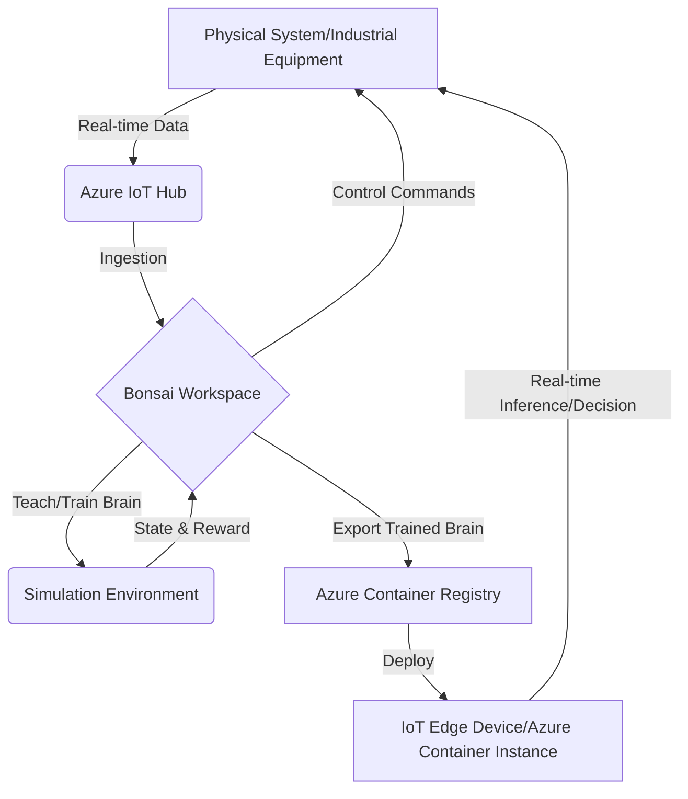

# AI Bonsai

### 🛠️ Azure Bonsai: Intelligent Control for Autonomous Systems

#### 1\. Overview

Azure Bonsai is a machine teaching platform that simplifies the development and deployment of autonomous systems. It is designed to empower subject matter experts (SMEs) and engineers, who may not be AI experts, to build intelligent control systems. Instead of relying on vast datasets like traditional machine learning, Bonsai uses a unique approach called **machine teaching**, which combines reinforcement learning with human expertise and simulations. This allows the "brain" to be taught a desired behavior through a curriculum, making the process more efficient and transparent.

#### 2\. Problem Statement & Business Use Cases

**Problem Statement:** An industrial manufacturing company wants to optimize its production line for a complex process. The current process relies on manual adjustments by a few highly experienced engineers, which leads to inefficiencies, inconsistent product quality, and high energy consumption. The company needs a scalable, automated solution that can adapt to real-time changes in the environment and make optimal decisions without constant human intervention.

**Business Use Cases:**

  * **Manufacturing:** Optimizing robotic arms for precision tasks, controlling chemical processes to maintain quality and reduce waste, or managing complex supply chain logistics.
  * **FinTech:** Creating autonomous trading agents that can learn and adapt to market changes.
  * **Energy/Utilities:** Optimizing energy consumption in smart buildings or managing power grid distribution in response to demand fluctuations.
  * **Robotics:** Training robots for complex navigation and manipulation in dynamic environments.
  * **Healthcare:** Automating laboratory processes and optimizing equipment performance.

#### 3\. Core Principles

  * **Machine Teaching:** This is the core principle of Azure Bonsai. Instead of "training" a model with a dataset, you "teach" it using a defined curriculum. This involves breaking down a complex problem into smaller, more manageable concepts.
  * **Reinforcement Learning (RL):** At its heart, Bonsai uses RL. The "brain" learns by trial and error in a simulated environment, receiving rewards for good actions and penalties for bad ones.
  * **Simulation-Driven Development:** Bonsai leverages digital twins and simulations to train the AI. This allows for rapid, safe, and cost-effective training without the risk or cost of using a physical system.
  * **Low-Code/No-Code:** The platform offers a low-code approach, making it accessible to domain experts who can define the problem and teach the AI without extensive programming knowledge.

#### 4\. Pre-Requirements

  * **Azure Subscription:** An active Azure account is required to create a Bonsai workspace.
  * **Azure Bonsai Service Resource:** You need to provision a Bonsai workspace in the Azure portal.
  * **Simulation Environment:** A key prerequisite is a simulation of the physical system you want to control. This can be a custom simulation built with Python or a third-party tool like MathWorks Simulink, AnyLogic, or VP Link.
  * **Inkling Language:** A domain-specific language used to define the machine teaching curriculum, goals, and concepts. It's a structured way to tell the AI what to learn and how to learn it.

#### 5\. Implementation Steps

1.  **Create an Azure Bonsai Workspace:** In the Azure Portal, search for "Bonsai" and create a new resource. This will be your central hub for building and managing the AI "brain."
2.  **Define the AI Specification (Inkling):** Using the Inkling language, define the state of the system (inputs), the actions the AI can take, and the high-level goals and concepts it needs to learn. For example, "stay within a certain temperature range" or "maximize throughput."
3.  **Connect to a Simulator:** Use the Bonsai CLI or API to connect your simulation environment to the Bonsai workspace. This allows the Bonsai platform to interact with the simulation, sending actions and receiving state updates.
4.  **Teach the Brain:** In the Bonsai UI, you'll define a teaching curriculum. This involves running the simulation and letting the AI "brain" learn from its actions based on the goals you've defined. The UI provides real-time visualizations and metrics to monitor the learning process.
5.  **Assess and Export the Brain:** Once the training is complete and the AI performs to satisfaction, you can assess its performance against a benchmark. The trained model can then be exported as a Docker container image to the Azure Container Registry.
6.  **Deploy the Trained Brain:** Deploy the containerized brain to a target environment. This can be an IoT Edge device for on-premise execution, an Azure Container Instance, or a Kubernetes cluster, depending on your needs. The brain exposes a REST API that the physical system can call for real-time decision-making.

#### 6\. Data Flow Diagram

#### 7\. Security Measures

  * **Managed Identity:** Use Azure Managed Identities for secure authentication between the Bonsai workspace and other Azure services like Azure Container Registry.
  * **Network Isolation:** Deploy the AI brain within a Virtual Network (VNet) to ensure it can only communicate with authorized resources.
  * **Role-Based Access Control (RBAC):** Apply the principle of least privilege. Grant users and applications only the permissions they need to access and manage Bonsai resources.
  * **Data Encryption:** Ensure that all data, both at rest and in transit, is encrypted. Use Azure Storage encryption for simulation files and TLS/SSL for communication channels.

#### 8\. Innovative Topic: Autonomous System for Predictive Maintenance

In a high-stakes industry like aerospace, a trained Azure Bonsai brain can be used to predict equipment failure. By connecting to real-time telemetry from sensors on a jet engine (vibration, temperature, pressure), the brain can learn the "normal" operating behavior. When it detects subtle deviations that a human might miss, it can make an optimal, real-time decision to alert maintenance staff, order a specific part replacement, or even adjust a setting to avoid a catastrophic failure. This isn't just automation; it's a dynamic, intelligent system that can learn from uncertainty and make complex judgments to prevent costly downtime.

#### 9\. Benefits

  * **Accelerated Development:** Reduces the time required to build and deploy complex control systems from months to weeks.
  * **Reduced Risk:** Training in a simulated environment eliminates the risk of damage to expensive physical equipment during the learning phase.
  * **Scalability:** Allows for the training of a single brain that can be deployed across hundreds or thousands of similar physical systems.
  * **Knowledge Codification:** Captures the expertise of veteran engineers and operators in a reusable, scalable AI model.
  * **Optimal Performance:** Enables the system to operate at peak efficiency, minimizing waste, energy consumption, and downtime.

#### 10\. Summary

Azure Bonsai is a powerful and accessible platform for building autonomous systems through a unique machine teaching approach. It demystifies reinforcement learning, allowing domain experts to codify their knowledge into an AI "brain" using simulations. This solution ensures real-time, optimal decision-making for complex industrial processes with minimal infrastructure overhead and significant business advantages.

**Key things to keep in mind about Azure Bonsai:**

1.  **It's for Control Systems:** Bonsai's primary focus is on autonomous control, not general-purpose machine learning. It's for systems that need to make sequential decisions in a dynamic environment.
2.  **Simulation is Mandatory:** You cannot use Bonsai without a working simulation of your physical system. The quality of your simulation directly impacts the effectiveness of the trained AI.
3.  **Human Expertise is Critical:** The "machine teaching" paradigm means that a subject matter expert is integral to the process. Their knowledge is what defines the curriculum and goals.
4.  **Inkling is the Language of Instruction:** You'll need to learn the basics of Inkling, the domain-specific language for defining the AI's curriculum. It's the key to translating human knowledge into a teachable format.
5.  **Deployment is to the Edge:** A major value proposition of Bonsai is deploying the trained brain to the "edge"—close to the physical system—for low-latency, real-time control.

**Related Topics/Reference Guidelines:**

  * Azure IoT Edge
  * Azure Machine Learning
  * Reinforcement Learning
  * Digital Twin
  * Azure Container Registry