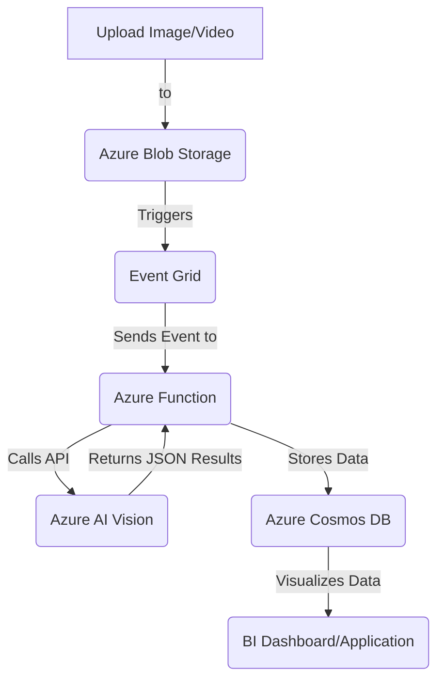
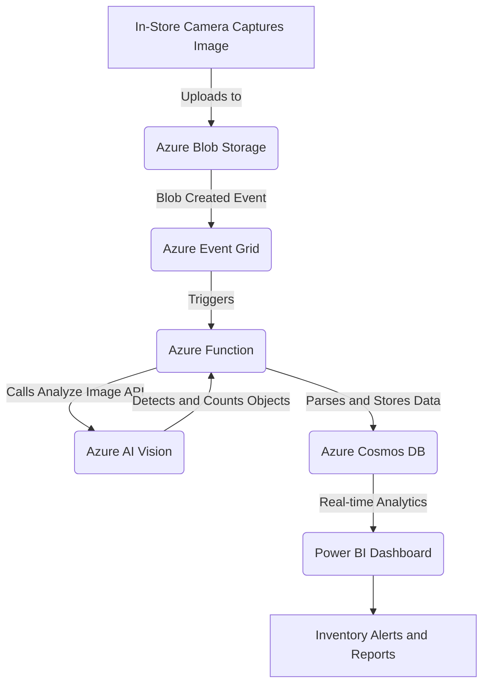
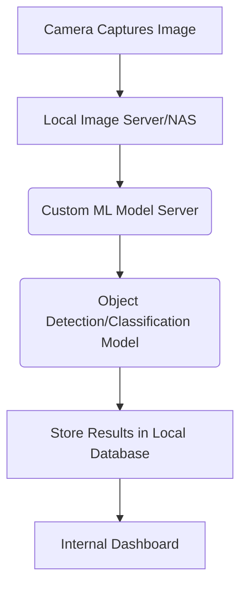

# Object Understanding
`Last Date : Aug-17-2025`
 
 

### **1. Overview** 🚀

Azure Object Understanding refers to the capabilities within **Azure AI Vision** that allow applications to analyze images and videos to identify, locate, and classify objects. This service uses pre-trained machine learning models to provide advanced computer vision functionality without requiring you to build and train your own models from scratch. It's a key component of the broader Azure AI services, enabling applications to "see" and "understand" visual content.

-----

### **2. Problem Statement & Business Use Cases** 🛠️

Many businesses rely on manual, time-consuming processes to monitor and manage physical assets or inventory. These tasks are prone to human error and are not scalable.

**Problem Statement:** A large retail chain, "SuperMart," needs to automate its inventory management to reduce stockouts, minimize waste, and improve employee efficiency. Manually counting products on shelves is a tedious process that can't keep up with the fast-paced retail environment.

**Business Use Cases:**

  * **Retail:** Automating inventory audits by using cameras in stores to detect and count products on shelves, ensuring items are in the correct location and stock levels are accurate. This can also be used for **planogram compliance**, verifying that product layouts match the approved floor plan.
  * **Manufacturing:** Quality control by detecting defects in products on a conveyor belt. For example, identifying mislabeled packages or damaged goods.
  * **Security & Surveillance:** Monitoring public spaces or restricted areas to detect specific objects, like unattended bags or unauthorized vehicles.
  * **Logistics:** Tracking packages and parcels in a warehouse by identifying their labels or unique features as they move through the facility.

-----

### **3. Core Principles**

Azure Object Understanding is built on the principles of **computer vision**, a field of AI that trains computers to interpret and understand the visual world.

  * **Pre-trained Models:** The service uses powerful, pre-trained deep learning models that have been trained on vast datasets. This means you don't need to be an AI expert to get started. You simply send an image or video stream to the API and it returns the results.
  * **API-based:** The service is consumed as a REST API, making it easy to integrate into any application, regardless of the programming language.
  * **Scalability:** The service is fully managed by Azure, offering a serverless model that automatically scales to handle any volume of requests, from a few images to millions of them.
  * **Object Detection:** This feature identifies the location of one or more objects within an image and provides a bounding box (coordinates) for each detected object.
  * **Image Tagging:** This provides a list of tags (labels) that describe the content of the image, such as "person," "car," "cat," "shelf," etc.
  * **Optical Character Recognition (OCR):** A related but distinct service within Azure AI Vision that can be used to extract text from images, such as product labels or price tags.

**Core Services & Resources:**

  * **Azure AI Vision:** This is the umbrella service that contains all the vision capabilities, including object detection, image analysis, and OCR. You create an Azure AI Vision resource in your subscription to use these features.
  * **Azure Blob Storage:** This service is used to store the images or video files that will be processed. It's a scalable and cost-effective object storage solution.
  * **Azure Functions:** A serverless compute service that can be used to trigger the image analysis process when a new file is uploaded to Blob Storage, connecting the different components of the solution.

-----

### **4. Pre-Requirements**

To implement the SuperMart inventory solution, you will need the following Azure services and tools:

  * **Azure Subscription:** An active Azure account to create and manage resources.
  * **Azure AI Vision Resource:** An instance of the Azure AI Vision service to perform object detection.
  * **Azure Storage Account:** An account with a Blob Storage container to hold the images captured from the store cameras.
  * **Azure Function App:** A Function App to host a serverless function that orchestrates the workflow.
  * **Azure Event Grid:** A service that provides event-driven architecture, used here to trigger the Azure Function when a new image is uploaded.
  * **Azure Cosmos DB (or another database):** A NoSQL database to store the processed data, such as product counts and timestamps.

-----

### **5. Implementation Steps**

1.  **Set up Azure Resources:**

      * Create a new **Resource Group** in the Azure Portal.
      * Deploy an **Azure Storage Account** with a new Blob Storage container (e.g., `store-images`).
      * Deploy an **Azure AI Vision** resource. Get the endpoint and API key.
      * Deploy an **Azure Function App** (Consumption plan is good for this use case).
      * Deploy an **Azure Cosmos DB** account and create a database and container to store the results.

2.  **Configure Event-Driven Trigger:**

      * In the Storage Account settings, navigate to the **Events** section.
      * Create an **Event Subscription** that listens for the "Blob Created" event.
      * Set the endpoint for the Event Subscription to be your **Azure Function**. This configures the function to automatically run every time a new image is uploaded to the blob container.

3.  **Develop the Azure Function:**

      * Write a serverless function (e.g., using Python or C\#) that is triggered by the Event Grid.
      * The function receives the blob details (image URL) as input.
      * It then calls the **Azure AI Vision API**, passing the image URL and specifying the `ObjectDetection` feature.
      * Parse the JSON response from the API to extract object names and confidence scores.
      * Process the data. For the SuperMart use case, this would involve counting the detected product objects (e.g., "juice bottle," "cereal box") and verifying their location.
      * Store the results (e.g., product counts, timestamps, and image metadata) in the **Cosmos DB** database.

4.  **Simulate Data Flow:**

      * To test the pipeline, upload an image of a store shelf to the `store-images` Blob Storage container.
      * The Event Grid will trigger the Azure Function.
      * The function will process the image using Azure AI Vision.
      * The results will be written to the Cosmos DB database.
      * You can then build a dashboard (e.g., using Power BI) on top of the Cosmos DB data to visualize real-time inventory levels.

-----

### **6. Data Flow Diagram**

#### **Diagram 1: General Data Flow for Object Understanding**

This diagram illustrates the core process of analyzing an image or video using Azure AI Vision.

#### **Diagram 2: SuperMart Inventory Management Use Case**

This diagram details the specific flow for the retail inventory management scenario.

-----

### **7. Security Measures** 🔒

  * **Least Privilege IAM Roles:** Use **Azure Role-Based Access Control (RBAC)** to grant the Azure Function app and other services only the minimum required permissions (e.g., read-only access to the Blob Storage container and write-only access to Cosmos DB).
  * **Managed Identities:** Use **Managed Identities** for Azure services to authenticate with other Azure resources (like Azure AI Vision and Cosmos DB) instead of using hard-coded credentials or API keys.
  * **Data Encryption:** Ensure data is encrypted both **in transit** (using HTTPS) and **at rest** (Azure Storage and Cosmos DB encrypt data by default).
  * **VPC Isolation:** For production environments, consider using **Azure Private Endpoints** to secure and isolate network traffic between your services, ensuring they do not traverse the public internet.

-----

### **8. Custom Vision for Specific Objects**

While Azure AI Vision's pre-trained models are great for common objects, many business cases require the detection of highly specific, proprietary items. This is where **Azure AI Custom Vision** comes in. It's a service that allows you to train your own object detection or image classification models using your own image data. For the SuperMart example, you would use this to train a model to specifically identify "SuperMart Cereal Box SKU\#123" and "SuperMart Juice Bottle SKU\#456" rather than generic "cereal box" or "juice bottle." The process involves uploading a small set of labeled images (e.g., 50 images per product), and the service handles the model training.

-----

### **9. When to Use and When Not to Use**

**When to Use:**

  * You need to quickly add computer vision capabilities to an application without a large investment in data science.
  * Your use case involves detecting common, well-defined objects (e.g., cars, people, animals, retail products).
  * You require a scalable, pay-as-you-go solution for processing a variable number of images.
  * You need to automate a manual visual inspection process, like quality control or inventory checks.

**When Not to Use:**

  * Your use case requires extremely high precision for subtle differences (e.g., tiny cracks in a microchip).
  * You need to identify and classify objects in real-time from an embedded device with no internet connectivity.
  * You have very specific, unique objects to detect and do not have a large enough dataset (at least 30-50 images per tag) to train a custom model. In this case, a manual process might still be more efficient.
  * Your application is highly sensitive to latency and cannot tolerate the round-trip network time to a cloud API.

-----

### **10. Costing Calculation** 💲

The cost of Azure AI Vision is primarily based on the **number of transactions** or API calls you make. It follows a pay-as-you-go model.

  * **Transaction Meter:** The main billing unit is typically per 1,000 transactions. A single API call to analyze an image is considered a transaction.
  * **Data Storage:** There is an additional cost for storing the images in Azure Blob Storage, which depends on the volume of data and the chosen storage tier (Hot, Cool, Archive).
  * **Serverless Compute:** The cost of the Azure Function is based on memory consumption and execution time. The first 1 million executions per month are often free.
  * **Database:** The cost of Azure Cosmos DB depends on the provisioned throughput (Request Units per second or RU/s) and the amount of data stored.

**Sample Calculation:**
Let's assume the SuperMart chain processes **100,000 images per month**.

  * **Azure AI Vision:** At a rate of approximately $1.50 per 1,000 transactions, the cost would be (100,000 / 1,000) \* $1.50 = **$150**.
  * **Azure Function:** The function runs for a few seconds per image. Assuming 2 seconds per execution and 128 MB of memory, the cost is minimal and would likely fall within the free tier.
  * **Storage:** If each image is 2MB, storing 100,000 images would be 200 GB. At a hot tier rate of \~$0.020 per GB, the monthly storage cost would be 200 \* $0.020 = **$4**.
  * **Cosmos DB:** A small-scale deployment might need 400 RU/s, costing around **$24/month**.

**Total Estimated Monthly Cost:** $150 (Vision) + $4 (Storage) + $24 (Cosmos DB) = **$178/month**.

**Efficient Way of Handling:**

  * Use the **Hot storage tier** for images that are being actively processed. Transition to the **Cool or Archive tier** for older images that are rarely accessed to save on storage costs.
  * Batch API calls if possible, though for a real-time event-driven system, per-image calls are necessary.
  * Monitor usage and set budgets using **Azure Cost Management** to avoid unexpected bills.

-----

### **11. Alternative Services**

| Service Provider | Alternative Service | Key Comparison/Difference |
| :--- | :--- | :--- |
| **AWS** | **Amazon Rekognition** | Highly competitive with Azure AI Vision. Offers a wide range of features including custom labels, content moderation, and celebrity recognition. Its primary difference lies in its deep integration with the AWS ecosystem (e.g., S3, Lambda). |
| **GCP** | **Google Cloud Vision AI** | Another strong competitor. Known for its powerful OCR and robust pre-trained models. It offers specialized features like Web Detection and Landmark Detection. Integration is seamless with other Google Cloud services like Google Cloud Storage and Cloud Functions. |
| **On-Premise** | **Custom Machine Learning Model with a Framework** | **Core Service:** TensorFlow or PyTorch. \<br\> **Data Storage:** Local NAS/SAN. \<br\> **Compute:** Local servers with GPUs. \<br\> **Key Difference:** Requires significant upfront investment in hardware, data science expertise, and ongoing maintenance. Offers complete control over data and models but lacks the scalability and ease of use of a cloud-native solution. |

#### **On-Premise Data Flow Diagram**

-----

### **12. Benefits**

  * **Cost Savings:** The pay-as-you-go model eliminates the need for large upfront hardware investments.
  * **Scalability:** The service scales automatically to handle any workload, from a few images to millions.
  * **Speed & Performance:** Cloud APIs offer fast processing times, enabling real-time or near-real-time applications.
  * **Automation:** Automates manual tasks, reducing human error and freeing up personnel for more critical work.
  * **Accessibility:** Allows developers without deep machine learning knowledge to build powerful AI applications.
  * **Quality & Accuracy:** The models are constantly improved by Microsoft, ensuring high accuracy.

-----

### **13. Enterprise-Grade Implementation**

For a large enterprise like SuperMart, a robust implementation would go beyond the basic data flow. It would involve integrating with enterprise systems for a complete solution.

  * **ERP/Inventory System Integration:** The output from the Cosmos DB (product counts, shelf locations) would be automatically synced with the company's Enterprise Resource Planning (ERP) or inventory management system. This ensures the central system has real-time, accurate stock levels.
  * **Alerting & Workflow Automation:** Logic Apps or Power Automate can be used to trigger alerts to store managers when stock levels of a specific product fall below a certain threshold.
  * **Data Analytics:** The data in Cosmos DB can be fed into a data warehouse like Azure Synapse Analytics for historical trend analysis (e.g., identifying seasonal demand changes, predicting stockouts, or analyzing employee efficiency).

-----

### **14. Summary**

Azure Object Understanding, primarily powered by **Azure AI Vision**, provides a powerful and accessible way to infuse computer vision into applications. By leveraging a serverless, API-based approach, it enables developers to automate visual tasks like inventory management and quality control with minimal overhead. The pay-as-you-go model and seamless integration with other Azure services make it a highly scalable and cost-effective solution for a variety of industries.

**What to keep in mind:**

1.  **Cost is Usage-Based:** Be mindful of the number of API calls, as costs scale with usage. Use Azure Cost Management to monitor and budget.
2.  **Data Privacy:** Understand and adhere to data privacy regulations, especially when handling images of people.
3.  **Model Limitations:** Pre-trained models are great, but they may not be perfect for highly specific, unique objects. Use Azure AI Custom Vision for those cases.
4.  **Integration is Key:** The real power comes from integrating the vision service with other systems, like your ERP or alerting tools.
5.  **Quality of Input:** The accuracy of object detection heavily depends on the quality of the input images (lighting, angle, resolution).

-----

### **15. Related Topics**

  * **Azure AI Vision Documentation:** [https://docs.microsoft.com/en-us/azure/ai-services/vision-studio/overview](https://www.google.com/search?q=https://docs.microsoft.com/en-us/azure/ai-services/vision-studio/overview)
  * **Azure AI Custom Vision:** [https://docs.microsoft.com/en-us/azure/ai-services/custom-vision-service/](https://www.google.com/search?q=https://docs.microsoft.com/en-us/azure/ai-services/custom-vision-service/)
  * **Azure Functions Documentation:** [https://docs.microsoft.com/en-us/azure/azure-functions/](https://docs.microsoft.com/en-us/azure/azure-functions/)
  * **Azure Event Grid Documentation:** [https://docs.microsoft.com/en-us/azure/event-grid/overview](https://docs.microsoft.com/en-us/azure/event-grid/overview)